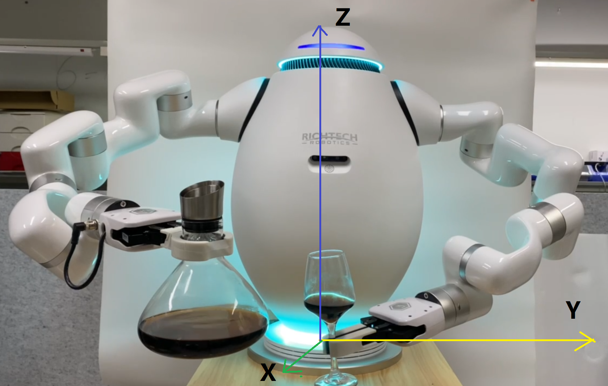

Config Env
""""""""""""""""

coluffee config file in /richtech/clouffee/settings, If you want to change key point, please modify wake-demo.yml

User coordinate
#########################################

Adam follows a right-handed coordinate system, the mounted platform is the xoy plane, the x-axis is facing the user, and the z-axis is the normal vector up from the bottom disc.

adam.yml
####################################

Most of the time you don't need to modify this file.

The only config you may need to change is the gripper tcp_offset/tcp_load. You can add a new gripper config like second.

Then modify different_config -> gripper -> name as second.

::

    gripper_config:
      first:
        tcp_offset:
          x: 0
          y: 0
          z: 210
          roll: 0
          pitch: 0
          yaw: 0
        tcp_load:
          weight: 0.82
          center_of_gravity:
            x: 0
            y: 0
            z: 48

project.ini
####################################

Please don't modify it unless you known want you do.

machine.yml
####################################

::

    adam:
      left: 192.168.2.226  # left adam arm ip
      right: 192.168.2.240 # right adam arm ip

    coffee:
      - device: /dev/ttyUSB0 # coffee device
        outlet: # coffee machine water outlet point
      - device: /dev/ttyUSB1 # coffee device
        outlet: # coffee machine water outlet point

    gripper:
      open: 850 # gripper open distance
      close: 280 # gripper close distance

    sink: # not use
      - # adam arm pour water point
      - # adam arm pour water point

    put:
      - device: /dev/ttyUSB0 # not use
        pose: # adam arm put cup point
      - device: /dev/ttyUSB1 # not use
        pose: # adam arm put cup point

    get:
      - device: /dev/ttyUSB0 # not use
        pose: # adam arm get cup point
      - device: /dev/ttyUSB1 # not use
        pose: # adam arm get cup point

    cup_size:
      big: 130
      middle: 110

    default_speed:
      arm: 500 # adam arm move speed in position mode
      gripper: 15000 # gripper open and close speed