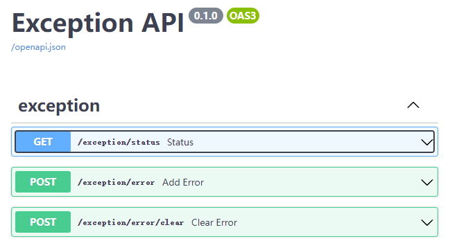
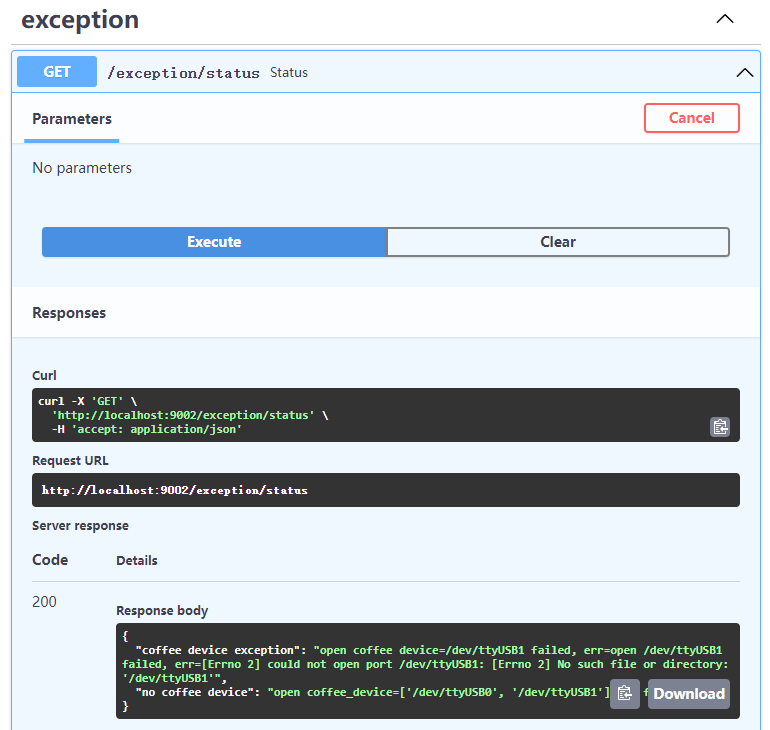

Get Start
""""""""""""""""

before start
##############################

1. goto :ref:`Config Env` to adapt the local robot environment.
#. goto :ref:`Service` to understand the meaning of all services.
#. goto https://www.youtube.com/watch?v=Nymyc8-WeHM to learn how to use swaggerUI.

use exception interface
####################################

refer to :ref:`Interface Url` to see exception url, open exception url, you will see following:

Click "Try it out" then click "Execute", I get this response.

This status interface collect all critical exception in this project(not completed).

If there is no exception return, we can try another service interface.

use coffee interface
####################################

refer to :ref:`Interface Url` to see coffee url, open it.

you can test /coffee/make interface to see coffee machine corresponding.

use audio interface
####################################

refer to :ref:`Interface Url` to see audio url, open it.

you can test /audio/tts interface let adam speaking.

use adam interface
####################################

refer to :ref:`Interface Url` to see adam url, open it.

When adam service start successfully, it will control two arms goto initial position.

Use adam interface is dangerous, I advice you not use /adam/angle and /adam/position.

Let's use /adam/position/initial interface to test, select left or right arm, and set angle is 30, execute it.

use center interface
####################################

If above Interface test ok, we can use center interface to create a order, it can control adam arm to get cup,
control coffee to make coffee and speak words when completed.